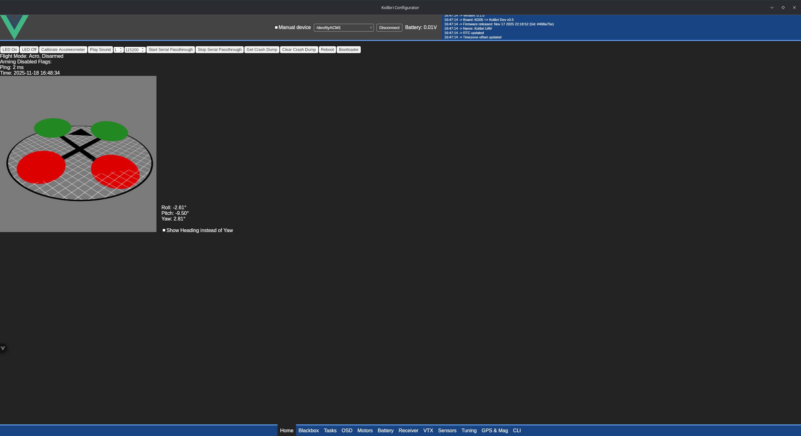
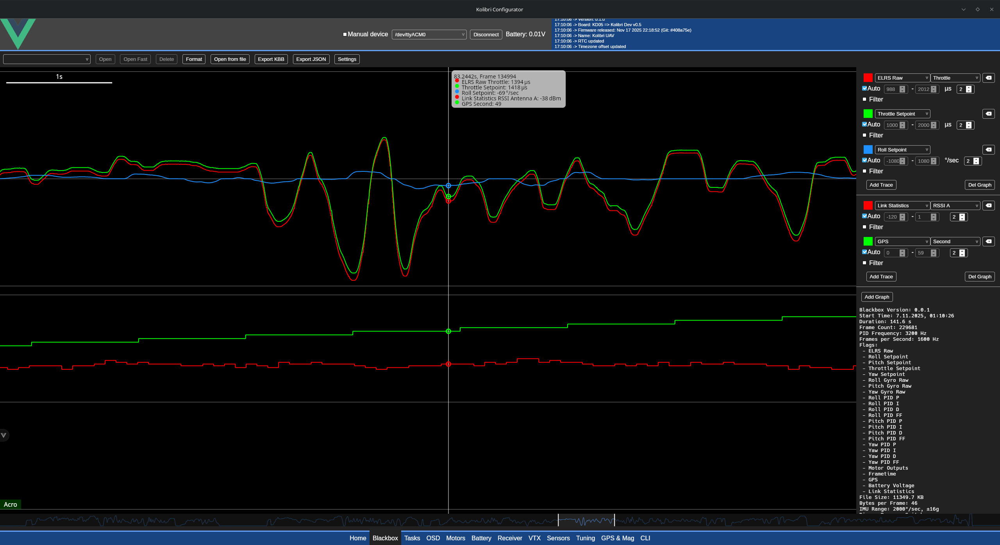
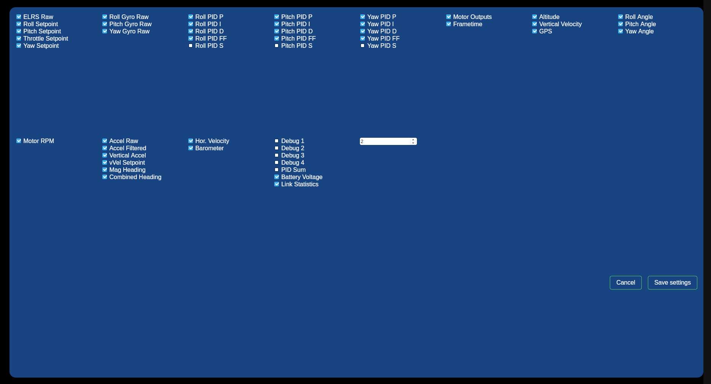
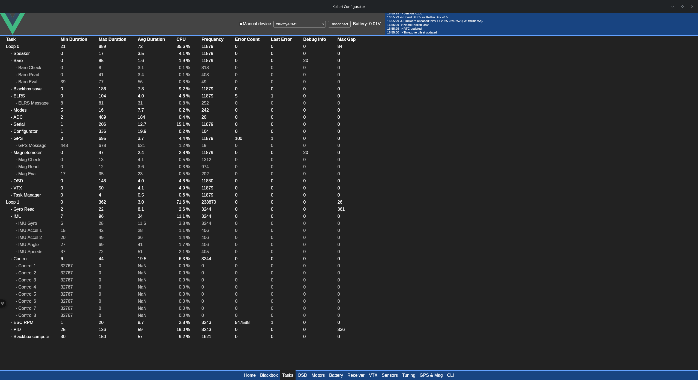
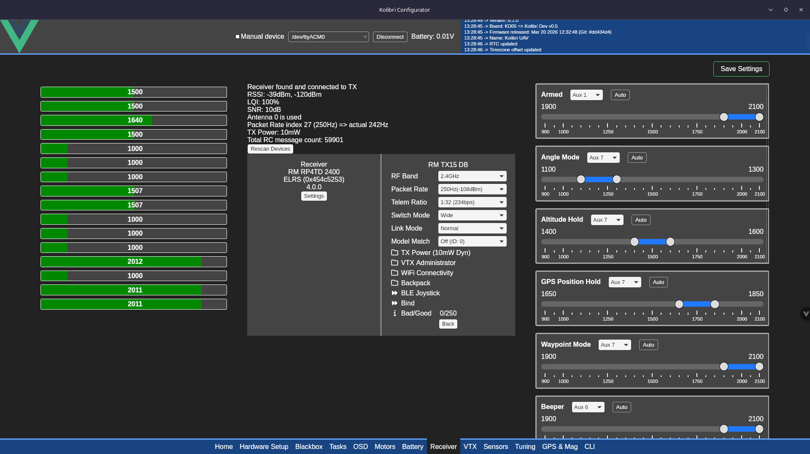
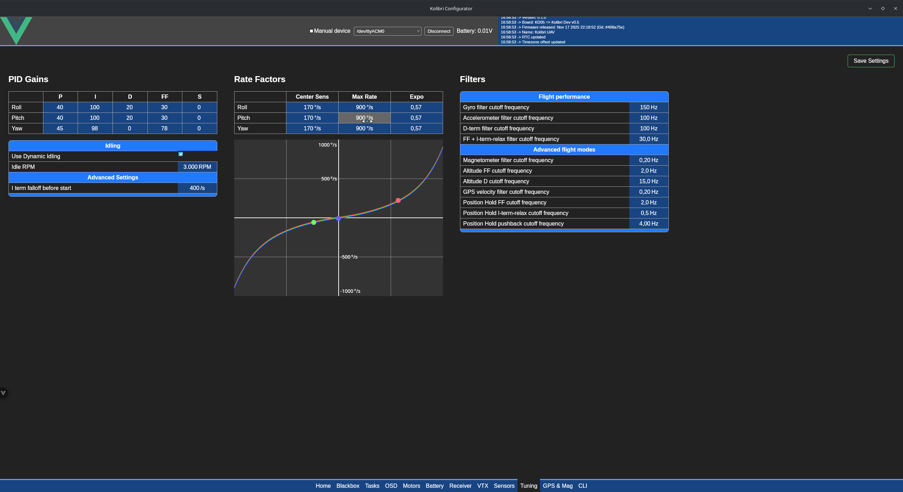
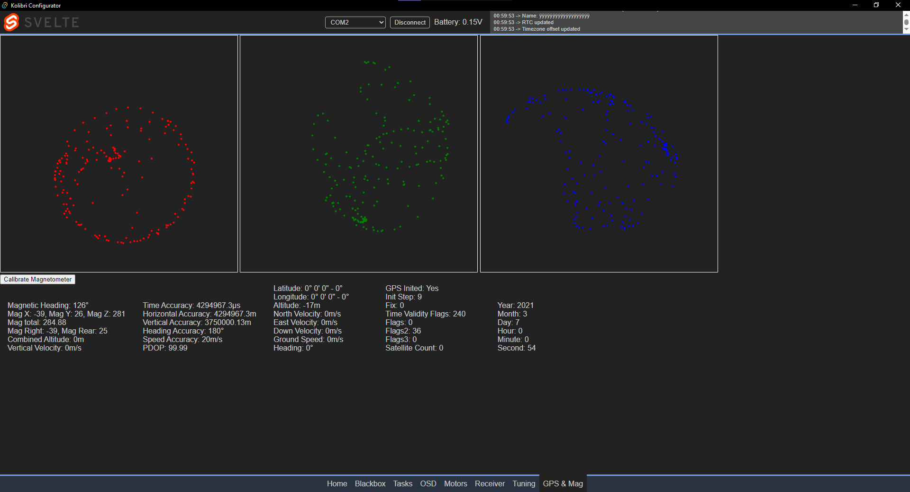
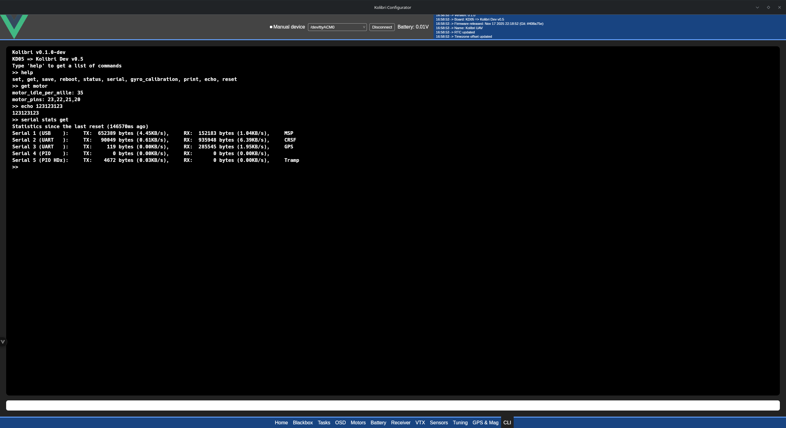
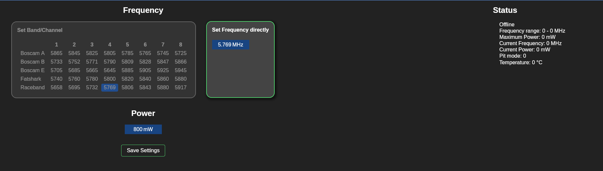
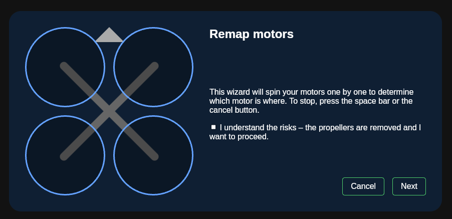

# RP2350 Flight Controller for FPV

I wanted to have some fun designing my own flight controller in both hardware and software. [This project of mine](https://github.com/bastian2001/Hardware-DShot-on-RP2040) ([superseded](https://github.com/bastian2001/pico-bidir-dshot/)) served as a proof of concept (and mostly minimal example) that the RP2040 is capable of driving DShot through the PIO (Programmable IO) hardware.

Main software features:

- Configurator
- Acro and angle modes
- altitude and position hold modes (working, but need to be tuned)
- ELRS
- GPS (UBlox) and Compass (HMC5883 + QMC5883L)
- Bidirectional DShot 4800 (tested up to 1200)
- Variable frequency beeper with WAV support
- SD-Blackbox incl. viewer
- Barometer (Goertek SPL06-001 + STM LPS22HB)

> [!NOTE]
> The PCB now lives in [its own repo](https://github.com/bastian2001/Kolibri-FC-Hardware)

Future shit:

- return to home and waypoint mission (incl. emergency switch)
- 3D camera dolly
- trick trainer, that does a trick for you and displays in the OSD how good or bad you were at repeating that trick

Practically speaking, is there any reason to choose this over Betaflight or iNav? Likely not, but I want to have a challenge.

## Configurator screenshots

Home Page with a general preview of the quad's orientation, some status info and general controls

Blackbox viewer integrated into the configurator. You can record ELRS data, gyro rates, PID, a bunch of sensor data and much more. Size is practically unlimited (SD card logging), for me it is usually in the range of 80-150KB/s. Integrated filtering to smooth noisy data, multiple graphs and multiple traces per graph, JSON converter for external analysis, pinch to zoom (touchscreen support).

Tasks viewer shows the execution duration and frequency of all the tasks to check they're running fast enough and to aid optimization of code. Some functions are not always running, hence the NaN and 0Hz.

Receiver Page shows status of the RX and each channel. It also allows you to set which switch is used for arming etc., and you can set things up on the receiver, transmitter and other devices (ELRS 4.0+ required (maybe Crossfire also works)).

Tuning of PIDs and filters, as well as rates, with live preview of rates and Blender-style input boxes

GPS + Mag page shows X/Y Y/Z and Z/X graphs of the magnetometer to check calibration and skew. Lower side shows data obtained by the GPS (no GPS fix right now, so time is off)

CLI for some additional settings and easier development and testing of new ones

More features: Motor remapping and Analog VTX channel adjustment (IRC Tramp)

You can also connect via you ELRS' WiFi, and everything except very large CLI operations and the Tasks viewer works the same way (512 byte limit on ELRS side). Even blackbox data can be transmitted over WiFi.
